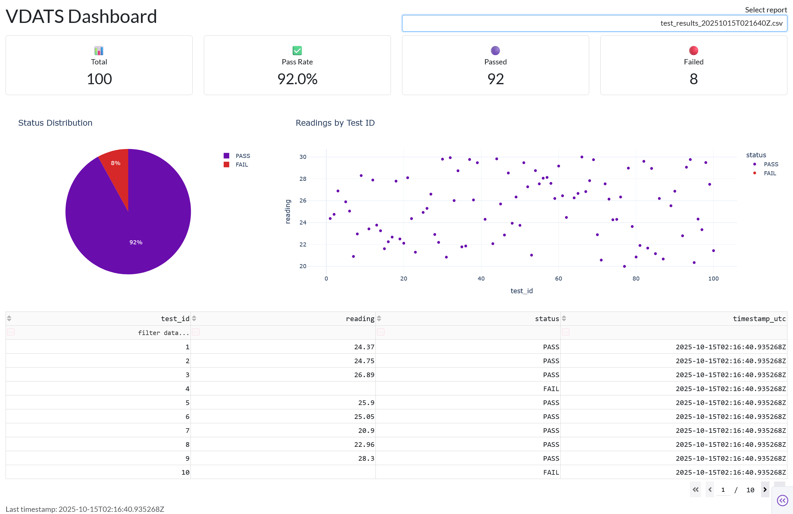

# 🧪 VDATS — Virtual Device Automated Test System

[](https://github.com/SupremeNoble/VDATS/actions)


**VDATS (Virtual Device Automated Test System)** is a fully software-based simulation of an **Automated Test Equipment (ATE)** workflow designed for reliability testing, continuous integration, and dashboard monitoring.  

It mimics how real test engineers validate device readings, collect results, analyze pass/fail distributions, and integrate everything with CI/CD pipelines.

---

## 🚀 Features

✅ **Virtual Sensor Simulation**  
- Generates deterministic temperature readings (20–30 °C).  
- Configurable fail rate to simulate hardware errors.  
- UTC-timestamped metadata for each reading.

✅ **Automated Test Harness**  
- Runs multiple test iterations with reproducible RNG seeding.  
- Generates structured CSV test reports.  
- Implements realistic pass/fail conditions within temperature specs.

✅ **Interactive Dashboard (Dash + Plotly)**  
- Visualize readings, pass/fail counts, and trends over time.  
- View results for any test report.  
- Real-time KPIs: Total Tests, Pass Rate, Passed, Failed.

✅ **Continuous Integration (GitHub Actions)**  
- Automatically runs unit tests with `pytest` on every commit.  
- Generates daily test reports on a schedule.  
- Uploads reports as CI artifacts for download and review.

✅ **Extensible Architecture**  
- Modular design (DUT, Test Automation, Dashboard, Aggregator).  
- Ready for real sensor integration or hardware I/O extension.

---

## 🧰 Project Structure
```
VDATS/
│
├── dut.py # VirtualSensor (Device Under Test)
├── test_automation.py # Automated test harness
├── test_vdats.py # Unit tests (pytest)
├── dashboard.py # Interactive test dashboard (Dash)
├── aggregate_reports.py # Aggregate multiple reports
├── requirements.txt # Python dependencies
├── .github/workflows/ci.yml # Continuous Integration pipeline
└── reports/ # Auto-generated test CSVs
```

---

## ⚙️ Installation & Setup

### 1️⃣ Clone the repository
```bash
git clone https://github.com/SupremeNoble/VDATS.git
cd VDATS
```
### 2️⃣ Create and activate virtual environment
```bash
python -m venv .venv
# Windows PowerShell
.\.venv\Scripts\Activate.ps1
# Linux / macOS
source .venv/bin/activate
```
### 3️⃣ Install dependencies
```bash
pip install -r requirements.txt
```

---

## 🧾 Running Tests Locally

### Run the automated test harness
```bash
python test_automation.py --iterations 100 --seed 42
```
### This generates a CSV report under reports/, e.g.:
```bash
reports/test_results_20251015T120000Z.csv
```

---

## 📊 Launching the Dashboard

### Start the dashboard server:
```bash
python dashboard.py
```
### Then open your browser at:
👉 http://localhost:8050

### You'll see:
* Pass/Fail distribution pie chart
* Scatter plot of readings vs Test ID
* Interactive data table
* KPI summary cards

---

## 🧩 Continuous Integration (CI)

### CI/CD is powered by GitHub Actions (`.github/workflows/ci.yml`):
* **Triggers**:
  * On every main branch push
  * Daily at 01:00 UTC
  * Manual dispatch
* **Steps**:
  1. Checkout code
  2. Install dependencies
  3. Run unit tests (pytest)
  4. Generate a small 10-iteration report
  5. Upload artifacts (CSV reports & test logs)

You can view each CI run under  
**GitHub → Actions → VDATS CI → (latest run)**

Artifacts (test results) can be downloaded from the run summary.

---

## 🧮 Example Output

| test_id | reading | status | timestamp_utc        |
| ------- | ------- | ------ | -------------------- |
| 1       | 24.5    | PASS   | 2025-10-15T12:00:01Z |
| 2       | 19.2    | FAIL   | 2025-10-15T12:00:02Z |
| 3       | 28.9    | PASS   | 2025-10-15T12:00:03Z |

---

## 🧪 VDATS Dashboard Preview



---

## 🧠 Future Enhancements
* Add multi-sensor simulation (e.g., humidity, pressure).
* Generate HTML/PDF test summary reports.
* Integrate Slack/Discord notifications for failed CI runs.
* Add REST API for test result uploads.

---

## 🧾 License
This project is released under the [MIT License](LICENSE).

---

## 🧍‍♂️ About
Created by Syed Ahmad Bin Syed Alwee  
🎓 Computer Engineering Graduate | 🧠 Aspiring Test / Automation Engineer  
💼 Focus Areas: Automated Testing, Data Visualization, and CI/CD Systems
